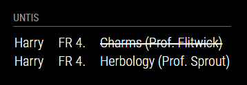

# MMM-Webuntis

This an extension for the [MagicMirror](https://github.com/MichMich/MagicMirror). It allows to display your kids' cancelled and irregular lessons for schools using [Untis](https://www.untis.at) software to organize school's timetables. You are able to configure access for each of your kids.

## Installation

1. Navigate into your MagicMirror's `modules` folder and execute `git clone https://github.com/thyed/MMM-Webuntis.git`.
2. Navigate into the new folder `MMM-Webuntis` and execute `npm install` to generate the node dependencies.

## Using the module

To use this module, add it to the modules array in the `config/config.js` file:

```javascript
modules: [
    {
        module: "MMM-Webuntis",
        position: "top_right",
        header: "Untis",
        config: { // see 'Configuration options' for more information
            students: [
                {
                    title: "1st child's name",
                    school: "your school",
                    username: "your untis username",
                    password: "your untis password",
                    server: "untis server"
                },
                {
                    title: "2nd child's name",
                    school: "your school",
                    server: "untis server",
                    class: "2nd child's class name"
                },
            ],
            days: 1,
            fetchInterval: 5*60*1000,
            showStartTime: false,
            showRegularLessons: false,
            showTeacher: true,
            shortSubject: false
        }
    }
```

## Configuration options

The following properties can be configured:

<table width="100%">
    <thead>
        <tr>
            <th>Option</th>
            <th width="100%">Description</th>
        </tr>
    <thead>
        <tr>
            <td><code>students</code></td>
            <td>
                Array of untis login credentials objects<br>
                <br><b>Possible values:</b> <code>array</code> of objects with the following attributes:
                <table>
                    <tr>
                        <td><code>title</code></td>
                        <td>Title of the entry, e.g. kid's name</td>
                    </tr>
                    <tr>
                        <td><code>school</code></td>
                        <td>School name as in the URL after having logged in at <a href="https://webuntis.com/">webuntis.com</a>. A plus sign (+) in the URL can be replaced by space.</td>
                    </tr>
                    <tr>
                        <td><code>username</code></td>
                        <td>Username used to login at Untis<br>(Optional, only required if student has custom login)</td>
                    </tr>
                    <tr>
                        <td><code>password</code></td>
                        <td>Password used to login at Untis<br>(Optional, only required if student has custom login)</td>
                    </tr>
                    <tr>
                        <td><code>server</code></td>
                        <td>Server as shown in the URL after having logged in at <a href="https://webuntis.com/">webuntis.com</a>, e.g. <code>kephiso.webuntis.com</code></td>
                    </tr>
                    <tr>
                        <td><code>class</code></td>
                        <td>Name of class to show<br>(Optional, only required if Anonymous mode is used)</td>
                    </tr>
                    <tr>
                        <td><code>useClassTimetable</code></td>
                        <td>It seems, that some schools do not provide an individual timetable but only the
                        class timetable. Try to set this to <code>true</code> if you don't receive any elements.
                        <br><br><b>Default value:</b> <code>false</code></td>
                    </tr>                    
                </table>
            </td>
        </tr>
        <tr>
            <td><code>days</code></td>
            <td>
                Number of days to look ahead<br>
                <br><b>Possible values:</b> <code>int</code> from <code>1</code> to <code>10</code>
                <br><b>Default value:</b> <code>7</code>
            </td>
        </tr>
        <tr>
            <td><code>fetchInterval</code></td>
            <td>
                Defines how often the module shall retrieve data from Untis<br>
                <br><b>Possible values:</b> <code>int</code> in milliseconds
                <br><b>Default value:</b> <code>5*60*1000</code> (5 Minutes)
            </td>
        </tr>
        <tr>
            <td><code>showStartTime</code></td>
            <td>
                Whether time or lesson order number shall be shown<br>
                <br><b>Possible values:</b> <code>true</code> or <code>false</code>
                <br><b>Default value:</b> <code>false</code><br><br>
                The module tries to achieve the timetable of the school and currently assumes that Monday's lesson times are valid for the whole week. When set to <code>false</code> the module matches a start time like "07:40" to "1." for example.
            </td>
        </tr>
        <tr>
            <td><code>showRegularLessons</code></td>
            <td>
                Whether to show also regular lessons or not<br>
                <br><b>Possible values:</b> <code>true</code> or <code>false</code>
                <br><b>Default value:</b> <code>false</code>
            </td>
        </tr>
        <tr>
            <td><code>showTeacher</code></td>
            <td>
                Whether to show also teachers name or not or just the initial<br>
                <br><b>Possible values:</b> <code>true</code> or <code>false</code> or <code>"initial"</code>
                <br><b>Default value:</b> <code>true</code>
            </td>
        </tr>
        <tr>
            <td><code>shortSubject</code></td>
            <td>
                Whether to show just the subject initials or full subject name<br>
                <br><b>Possible values:</b> <code>true</code> or <code>false</code>
                <br><b>Default value:</b> <code>fasle</code>
            </td>
        </tr>
        <tr>
            <td><code>debug</code></td>
            <td>
                Use only for debug purposes!<br>If set to true, the timetable from WebUntis and the parsed lessons will be printed to the MM log<br>
                <br><b>Possible values:</b> <code>true</code> or <code>false</code>
                <br><b>Default value:</b> <code>fasle</code>
            </td>
        </tr>
</table>

## How it works

This module may be useful for students at schools using Untis for the organization of time tables. It uses the node.js wrapper of the WebUnits API by TheNoim and retrieves all lessons in a specified number of days time period. It displays cancelled or irregular subjects so that kids are able to prepare for the next day without pulling the information from the Untis app. The module can be configured for several students.

## Dependencies

- [node.js Wrapper for WebUntis API](https://github.com/TheNoim/WebUntis) (installed via `npm install`)

## Screenshots



## Attribution

This project is based on work done by Paul-Vincent Roll in the MMM-Wunderlist module. (<https://github.com/paviro/MMM-Wunderlist>)
